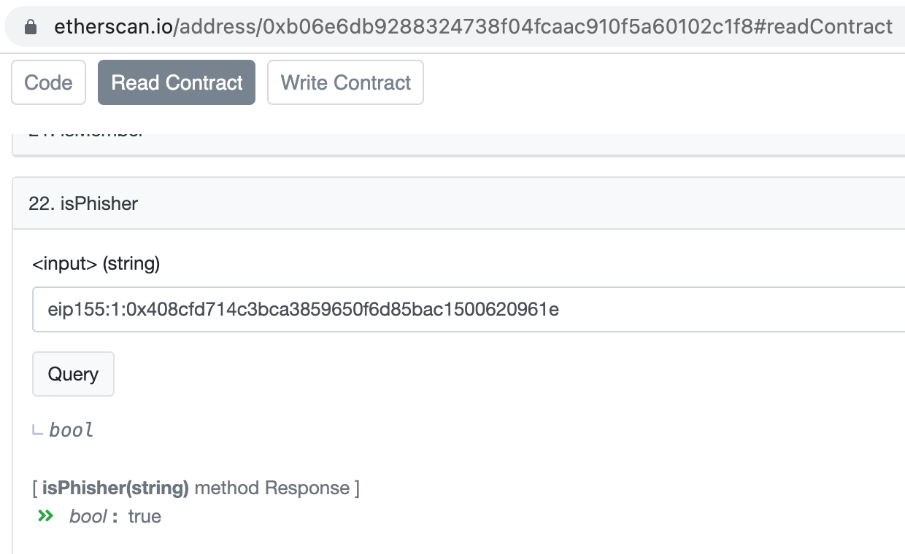
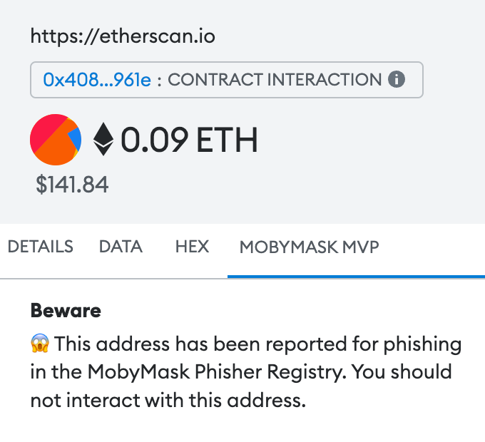

# MobyMask MVP Snap

A snap that warns you when interacting with a contract that has been identified as a phisher in the MobyMask Phisher Registry.

The snap can be installed from the dapp here: [montoya.github.io/get-mobymask-snap/](https://montoya.github.io/get-mobymask-snap/).

Built for the MetaMask 2022 holiday hackathon by Christian Montoya with help from Dan Finlay and moral support from Barbara Schorchit.

## How it works

The following is an explanation of the MobyMask snap code. It will help you learn how to write transaction insights snaps and how to use Ethers and the ethereum provider from a snap to read onchain data. 

### package/snap/snap.manifest.json

This project is based on the [template-snap-monorepo](https://github.com/MetaMask/template-snap-monorepo), with the following changes made: 

- The `description`, `proposedName`, and `repository` sections are modified 
- Under `initialPermissions`, `"endowment:transaction-insight": {}` has been added to support transaction insights

### Installing additional dependencies 

This snap needs the following packages: `@metamask/utils`, `@metamask/abi-utils`, `ethers`. They are added to the snap by running the following command in `packages/snap`: 

`yarn add @metamask/utils @metamask/abi-utils ethers`

### packages/snap/src/index.ts

```TypeScript
import {
  OnTransactionHandler,
  OnRpcRequestHandler,
} from '@metamask/snap-types';
import { getInsights } from './insights';

/**
 * Handle an incoming transaction, and return any insights.
 *
 * @param args - The request handler args as object.
 * @param args.transaction - The transaction object.
 * @returns The transaction insights.
 */
export const onTransaction: OnTransactionHandler = async ({ transaction }) => {
  return {
    insights: await getInsights(transaction),
  };
};

/**
 * Handle incoming JSON-RPC requests, sent through `wallet_invokeSnap`.
 *
 * @param args - The request handler args as object.
 * @param args.origin - The origin of the request, e.g., the website that
 * invoked the snap.
 * @param args.request - A validated JSON-RPC request object.
 * @returns `null` if the request succeeded.
 * @throws If the request method is not valid for this snap.
 * @throws If the `snap_confirm` call failed.
 */
export const onRpcRequest: OnRpcRequestHandler = (args) => {
  switch (args.request.method) {
    case 'hello':
      return wallet.request({
        method: 'snap_confirm',
        params: [
          {
            prompt: 'Hello there!',
            description: 'Thank you for installing the MobyMask MVP snap.',
            textAreaContent:
              'This snap will help you identify contracts that have been reported for phishing in the MobyMask Phisher Registry.',
          },
        ],
      });
    default:
      throw new Error('Method not found.');
  }
};
```

This is very similar to the template snap. There is a `hello` RPC method that can be called from a dapp, which is used to display a welcome message that explains the purpose of the snap. On top of that, this file imports the `onTransactionHandler` from `@metamask/snap-types` and the `insights.ts` file in the same folder. It exports a method for transaction insights and returns a `getInsights` function. To see what this function does, have a look at the `insights.ts` file. 

### packages/snap/src/insights.ts

The file is complex so I will break it down into parts: 

```TypeScript
import { remove0x, add0x } from '@metamask/utils';
import { decode } from '@metamask/abi-utils';
import { ethers } from 'ethers';

/**
 * As an example, get transaction insights by looking at the transaction data
 * and attempting to decode it.
 *
 * @param transaction - The transaction to get insights for.
 * @returns The transaction insights.
 */
export async function getInsights(transaction: Record<string, unknown>) {
```

This imports the relevant functions from the packages added earlier and creates the function `getInsights` which will take a transaction object. 

```TypeScript
  const mobyMaskAddress = '0xB06E6DB9288324738f04fCAAc910f5A60102C1F8';

  const hexChainId = await wallet.request({ method: 'eth_chainId' });
  const chainId = parseInt(`${hexChainId}`, 16);

  const returnObject: Record<string, any> = {};

  try {
    // Check if the transaction has data.
    if (chainId !== 1) {
      returnObject.Notice = 'Insights are only available for Ethereum mainnet.';
      throw 'Not on Ethereum mainnet.';
    }
```

First, this starts with a constant for the address of the [MobyMask Phisher Registry contract](https://etherscan.io/address/0xb06e6db9288324738f04fcaac910f5a60102c1f8). This will be used in multiple ways later in the code. 

Then, it checks if the user is on Ethereum mainnet by calling `wallet.request()`, and sets up the return object which holds the information that will be displayed to the user. 

Finally it checks if the chainId is not 1. In this case, it sets a message in the return object and throws an error that causes the rest of the code to be skipped. 

```TypeScript
    const mobyMaskABI = [...]; 

    const provider = new ethers.providers.Web3Provider(wallet);

    const mobyMaskContract = new ethers.Contract(
      mobyMaskAddress,
      mobyMaskABI,
      provider,
    );
```

The address and ABI of the MobyMask contract is used to create a contract interface with ethers. This is similar to how it would be used in a dapp, but instead of passing `window.ethereum` as the provider, it passes `wallet` which is the equivalent in a snap. This will be used to read data from the MobyMask contract on-chain. 

```TypeScript
let ethersReadResult = false;

    if (
      transaction.to === mobyMaskAddress.toLowerCase() &&
      typeof transaction.data === 'string'
    ) {
      // User is interacting with MobyMask contract
      ... 
    } else {
      // Check if the user is interacting with a phisher
      ethersReadResult = await mobyMaskContract.isPhisher(
        `eip155:1:${transaction.to}`,
      );

      if (ethersReadResult) {
        returnObject.Beware =
          '😱 This address has been reported for phishing in the MobyMask Phisher Registry. You should not interact with this address.';
      } else {
        returnObject.Notice =
          '🤔 This address has not been reported in the MobyMask Phisher Registry. This does not guarantee that it is safe to interact with. Proceed with care.';
      }
    }
  } catch (error) {
    console.error(error);
  }

  return returnObject;
}
```

Finally, this checks to see if the user is interacting with the MobyMask contract by comparing the `to` field of the `transaction` object to the `mobyMaskAddress` constant. Note that the `to` field is all lowercase, so both need to be lowercase to compare them. If the user is interacting with the contract, then there's a bunch of checks to see what the user is attempting to do and provide some useful information. These parts are not very important to the real use case of the MobyMask snap, which is warning users if they are interacting with phishers, so I have ommitted them from this guide, but you can read the [source code](https://github.com/Montoya/mobymask-snap/blob/main/packages/snap/src/insights.ts#L78) to see how it works. The important part is in the `else` clause. 

Recall that an ethers contract interface already exists in the constant `mobyMaskContract`. To check if the address is a phisher, the snap just needs to call the contract function `isPhisher` with the `to` address. The result of this check is a boolean. If the result evaluates to `true`, then the address has been reported as a phisher in the registry. If it is `false`, then the address has not been reported. It may or may not be a phisher! Therefore, a message is given in each case. 

You can test this `isPhisher` contract function on Etherscan [here](https://etherscan.io/address/0xb06e6db9288324738f04fcaac910f5a60102c1f8#readContract#F22), to confirm that you get the same result as in the snap. If you give it a contract address like `0x408cfd714c3bca3859650f6d85bac1500620961e` (this is a known phishing contract), then you will get back `true`. _Note that Ethereum addresses are prefixed with `eip155:1:`._



This is the end of the code, and the return object is returned. The content appears in the transaction insights tab for any send or contract interaction, like so: 



I hope this explainer has been helpful. Feel free to use this code in your own snap projects!